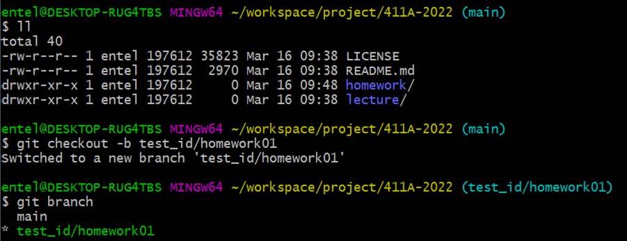
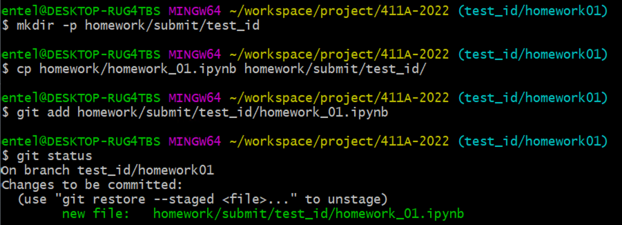
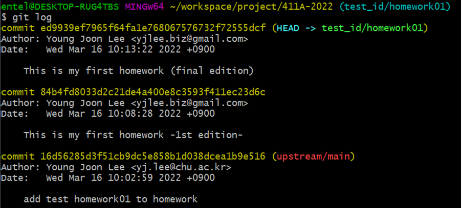
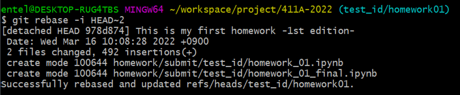
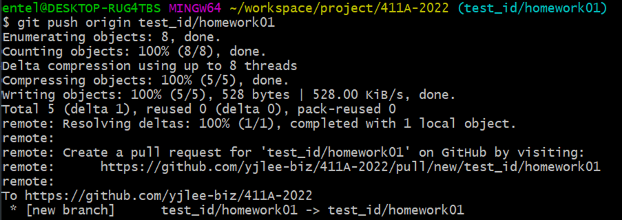
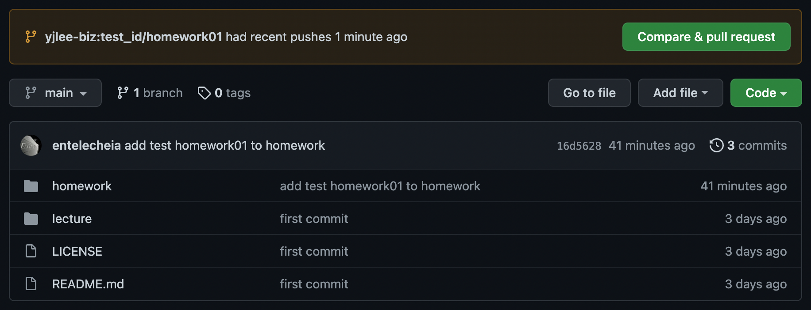
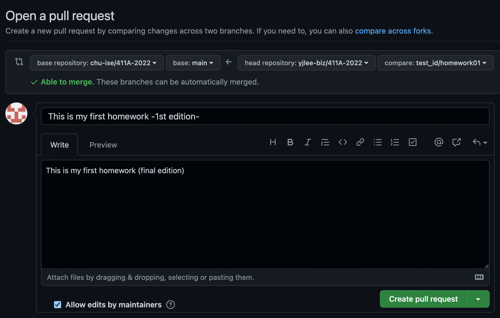

# How to use GitHub: Fork, branch, track, squash and pull request

This guide will teach you how to properly contribute to open source projects on GitHub. It assumes that you already know about how to use **Git** for version control and that you already have a GitHub account.

## Getting Started

### Global setup:

```sh
git config --global user.name "Your Name"
git config --global user.email you@example.com
```

### … create a new repository on the command line

```sh
echo "# 411A-2022" >> README.md
git init
git add README.md
git commit -m "first commit"
git branch -M main
git remote add origin https://github.com/your-github-id/411A-2022.git
git push -u origin main
```

### …or push an existing repository from the command line

```sh
git remote add origin https://github.com/your-github-id/411A-2022.git
git branch -M main
git push -u origin main
```

_GitHub displays these instructions when you start a new project._

GitHub is pretty great about giving advice to users starting new repositories, but it isn't very helpful when it comes to contributing changes back to other projects. Hopefully, this guide will help.

## Making Your Fork

  
_Hardcore Forking Action_


Here's the fun part! Hit 'Fork'. Now you've got your own version! Go to the page, get the ssh: url from the box at the top and then


## clone the epository

```sh
git clone https://github.com/your-github-id/411A-2022.git
```

to your local machine. Hooray! You have the code on your local machine now.

## Make Your Fork Track the Original Upstream Repo

Use the following commands to add the 'upsteam' (original project location) as a remote branch so that you can get _updates_ of the original repo into your branch.

```sh
cd 411A-2022
git remote add --track main upstream https://github.com/chu-ise/411A-2022.git
```

This will add the original project as a remote named 'upstream'. To get the code, type:

```sh
git fetch upstream
```

Then, to merge it into your own project, type:

```sh
git merge upstream/main
```

Now you'll have an up-to-date version of the upstream code in your current branch.

## Setting Up A Your Homework Branch


Now you're getting ready to start hacking, you'll want to switch off of the 'main' branch and onto a different branch for your homework. It's **important** to do this because you can only have _one_ **Pull Request** _per branch_, so if you want to submit more than one fix, you'll need to have multiple branches.

Make a new branch and then switch to it like this: `git checkout -b your_id/homework_#`

```sh
git checkout -b test_id/homework01
```

Now you're on your new branch. You can confirm this by simply typing:

```sh
git branch
```



## Hack! Do your works!

This part's up to you. Hack along as you normally would until the code is in the state where you're happy with it, it performs the task as described and it passes all the tests you've written for it.

#### make your submit folder and copy the homework

```sh
mkdir -p homework/submit/your_id
cp homework/homework_01.ipynb homework/submit/your_id
```

**Do your works!!**

#### add your homework to the git repo

```sh
git add homework/submit/your_id/homework_01.ipynb
git status
```



#### commit the changes to the repo

```sh
git commit -m "This is my first homework -1st edition-"
# modify your work and commit again until it' done
git commit -m "This is my first homework -final edition-"
```

## Squashing Your Commits

Before you submit your pull request back upstream, you'll want to **squash** these commits into a small handful of well-labeled commits. To do this, we're going to use the **git rebase** command. First, take a look at the commits we've made with _git log_ and figure out the commits that we want to squash. If we wanted to squash the last 2 commits into one, we'd open up an an interactive rebase like this:

```sh
git log
```



```sh
git rebase -i HEAD~2
```

This will bring you into your editor with some text that will look something like this:

```sh
pick 84b4fd8 This is my first homework -1st edition-
pick ed9939e This is my first homework (final edition)
```

To squash those commits into one, change to something like this:

```sh
pick 84b4fd8 This is my first homework -1st edition-
squash ed9939e This is my first homework (final edition)
```

Then, save/quit, and you'll be brought to into another editor session. Describe the changes as well as you can and save/quit again.

```sh
# This is a combination of 2 commits.
# This is the 1st commit message:

This is my first homework -1st edition-

# This is the commit message #2:

This is my first homework (final edition)
```



You've squashed your commits into one nice one. Now you're ready to submit a pull request.

## Submitting a Pull Request

Once you've commited and squashed your changes, push them to your remote like this:

```
git push origin test_id/homework01
```



Then go to that page on GitHub and change branches to the one for your new feature.


_Submit a Pull Request!_

Then, click on the little button that says 'Pull Request'. This will bring you to a page asking you to describe your change. Describe it thoroughly.


_Describe your Pull Request._

Then press 'Submit Pull Request'. Hooray! You did it. Now, you're not quite done yet. If the maintainer finds some problems with your code, they won't want to pull your changes until you fix them. Fortunately, whenever you commit and push more things to that branch of your code, they will be included in that pull request until it is closed.

## Extra: Accepting And Merging a Pull Request

If you're on the receiving end of a pull request, how do you merge the changes? Easy - press the button! GitHub now has an auto-merge button which does everything for you in one click. However, it doesn't always work, in which case you'll have to do the merge on your own machine, like so:

```
git checkout main
git remote add contributor https://github.com/your-github-id/411A-2022.git
git fetch contributor
git merge contributor/newfeature
git push origin main

```

And then their changes will be properly merged into your main branch.
